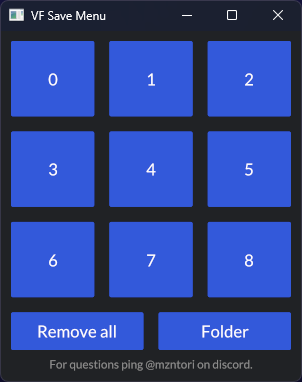

# Viewfinder Save Menu
Simple tool that allows to "delete" save-states of the game [Viewfinder](https://store.steampowered.com/app/1382070/Viewfinder/). It does that by moving the save-files into a separate folder inside the folder where saves are normally stored.

## Usage
The buttons labeled 0 through 8 represent the save files, ordered the way they are in game.
Clicking on the Save will move all corresponding Files to `../Viewfinder/VFMenu/` where a folder will be created, named the time of pressing the button(e.g. `2023-07-26T03-39-36Z`).
If you want to recover that save file simply make sure the slot is empty and copy the files back into `../Viewfinder/`.
(This will not take much space btw as the save-files are pretty small)

The button labeled `Remove all` unsurprisingly does that for all saves.

The `Folder` button opens `../Viewfinder/`.
On windows this ordner is located at `%appdata%/LocalLow/Sad Owl Studios/Viewfinder/`.

While it shouldn't be a problem, I wouldn't recommend using the tool on the save the game is running.

**I am not at fault if you lose any of your save files. But I have tested as much as I can and couldn't find a way to delete saves completely.**

## Install

### Windows
Download the zip from releases and unzip it.
